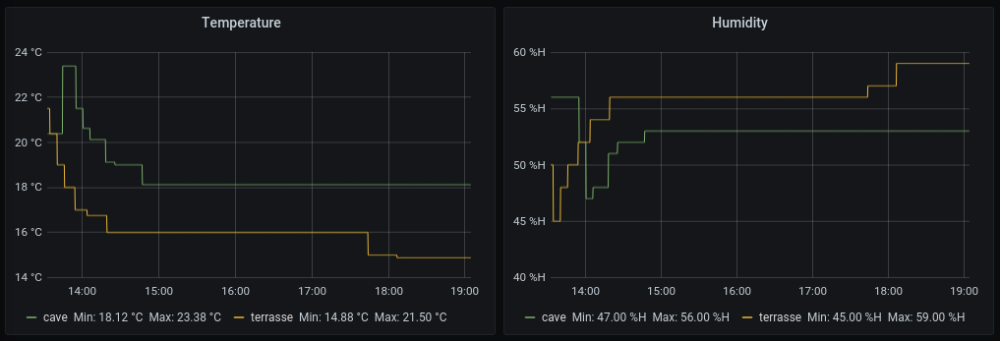

# shelly-ht-action-prometheus

shelly-ht-action-prometheus is a tool to expose action calls from a [Shelly H&T](https://shelly.cloud/products/shelly-humidity-temperature-smart-home-automation-sensor/) to Prometheus.



## Why?

Shelly H&T sensor supports MQTT but that requires you to run a MQTT broker on your network. Using a remote broker is not
possible because the sensor cannot communicate with the MQTT broken over TLS.

Collecting the sensor data via an authenticated action call over HTTPS seemed the easiest, and most secure way. 

## Usage

The service can be launched like this:

```
$> SENSOR_PASSWORD=<passphrase_to_submit_sensor_data> \
   ADDRESS_METRICS=127.0.0.1:17796 \ # Listen address exposing metrics to scrap with Promethes
   ADDRESS_SENSOR=127.0.0.1:17795 \ # Listen address for submitting the action call from the sensor
   shelly-ht-action-prometheus
```

If you want to run it as a SystemD service you can check the content of
[shelly-ht-action-prometheus.service](./systemd/shelly-ht-action-prometheus.service).

It is recommended to not expose directly the service but to put it behind a reverse proxy, so you can communicate with it
over HTTPS.

On the configuration panel of the Shelly H&T sensor, you need to add a new action call.

The action call URL needs to have the following format:

```
https://sensor:<sensor_password>@example.com/sensors/<sensor_name>
```

`<sensor_password>` is the passphrase you used when your started the service. `<sensor_name>` is the name used to label
the sensor in Prometheus.

The service exposes 3 metrics which are all labelled with a `name`:
 * `shellyht_temperature_celsius`: the temperature reported by the sensor
 * `shellyht_humidity_percent`: the humidity percentage reported by the sensor
 * `shellyht_last_report`: the last time the sensor reported a value
 